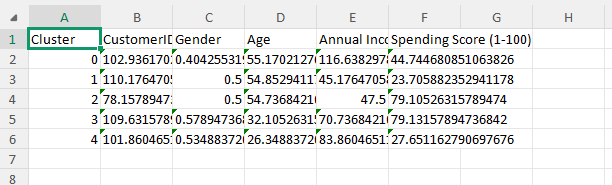
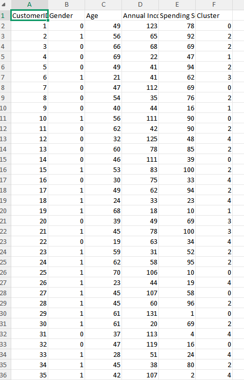
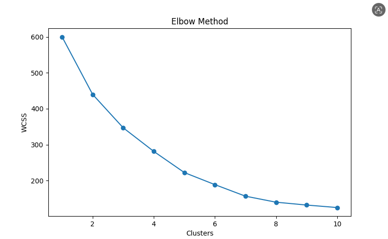
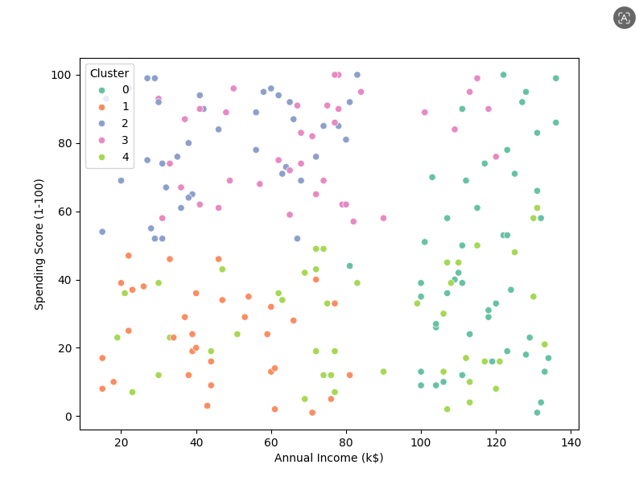
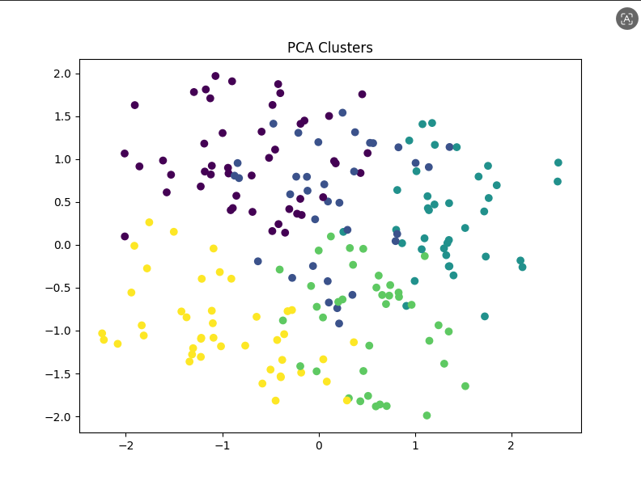

# Customer Segmentation Using Machine Learning

## Overview

Customer Segmentation is a Data Analytics and Machine Learning project that groups customers based on their purchasing behavior and income patterns. The project uses the Mall Customers dataset and applies K-Means Clustering to identify distinct customer segments.

The objective is to help businesses understand customer behavior, improve marketing strategies, and make data-driven decisions.

---

## Project Objectives

* Analyze customer demographics and spending behavior.
* Identify meaningful customer groups using clustering.
* Visualize customer segments using PCA.
* Generate business insights for targeted marketing campaigns.
* Build a modular and reusable data analytics pipeline.

---

## Technologies Used

### Programming Language

* Python

### Libraries

* Pandas
* NumPy
* Matplotlib
* Seaborn
* Scikit-Learn

### Machine Learning

* K-Means Clustering
* Principal Component Analysis (PCA)

### Tools

* VS Code
* Git & GitHub

---

## Dataset

The project uses the Mall Customers Dataset containing customer information such as:

| Feature                | Description                       |
| ---------------------- | --------------------------------- |
| CustomerID             | Unique customer identifier        |
| Gender                 | Customer gender                   |
| Age                    | Customer age                      |
| Annual Income (k$)     | Annual income in thousand dollars |
| Spending Score (1-100) | Customer spending score           |

---

## Project Structure

```text
CUSTOMER SEGMENTATION(DA)
│
├── dataset
│   └── Mall_Customers.csv
│
├── outputs
│   ├── cluster_summary.csv
│   ├── customer_segments.png
│   ├── elbow_plot.png
│   ├── pca_clusters.png
│   └── segmented_customers.csv
│
├── src
│   ├── __init__.py
│   ├── clustering.py
│   ├── data_loader.py
│   ├── pca_visualization.py
│   ├── profiling.py
│   └── utils.py
│
├── .gitignore
├── main.py
├── README.md
└── requirements.txt
```

---

## Workflow

### Step 1: Data Loading

* Load customer dataset.
* Verify data quality.
* Check for missing values.

### Step 2: Data Profiling

* Understand dataset characteristics.
* Explore customer demographics.
* Analyze spending behavior.

### Step 3: Data Preparation

* Select relevant features.
* Scale numerical data if required.
* Prepare data for clustering.

### Step 4: Elbow Method

* Calculate Within Cluster Sum of Squares (WCSS).
* Determine optimal number of clusters.
* Generate elbow plot.

Output:

```text
outputs/elbow_plot.png
```

### Step 5: K-Means Clustering

* Train clustering model.
* Assign customers to clusters.
* Generate segmented dataset.

Output:

```text
outputs/segmented_customers.csv
```

### Step 6: Cluster Analysis

* Calculate cluster statistics.
* Generate cluster summary report.

Output:

```text
outputs/cluster_summary.csv
```

### Step 7: Visualization

Generate visual representations of customer groups.

Outputs:

```text
outputs/customer_segments.png
outputs/pca_clusters.png
```

---

## Output Files

### cluster_summary.csv

Contains statistical summaries for each customer segment.


### segmented_customers.csv

Original customer data with assigned cluster labels.


### elbow_plot.png

Visualization used to determine the optimal number of clusters.


### customer_segments.png

Scatter plot showing customer segmentation results.


### pca_clusters.png

PCA-based visualization of customer clusters in reduced dimensions.


---

## Machine Learning Algorithm

### K-Means Clustering

K-Means is an unsupervised learning algorithm that groups similar customers together.

Key Steps:

1. Select number of clusters (K).
2. Initialize centroids.
3. Assign customers to nearest centroid.
4. Update centroid positions.
5. Repeat until convergence.

---

## Principal Component Analysis (PCA)

PCA is used to reduce dimensionality and visualize customer clusters more effectively.

Benefits:

* Better visualization
* Reduced complexity
* Improved cluster interpretation

---

## Business Insights

The project helps identify:

### High-Value Customers

Customers with high income and high spending scores.

### Potential Customers

Customers with high income but lower spending behavior.

### Budget Customers

Customers with lower income and lower spending patterns.

### Regular Customers

Customers showing moderate income and spending behavior.

These insights can help businesses create targeted marketing strategies and improve customer retention.

---

## Installation

Clone the repository:

```bash
git clone https://github.com/yourusername/customer-segmentation.git
```

Navigate to project folder:

```bash
cd customer-segmentation
```

Install dependencies:

```bash
pip install -r requirements.txt
```

---

## Run the Project

Execute:

```bash
python main.py
```

The program will:

* Load dataset
* Perform clustering
* Generate visualizations
* Save output files

---

## Results

The project successfully:

* Segmented customers into meaningful groups.
* Generated cluster summaries.
* Created visual analytics reports.
* Produced actionable business insights.

---

## Learning Outcomes

Through this project, I gained experience in:

* Data Cleaning
* Exploratory Data Analysis (EDA)
* K-Means Clustering
* PCA Visualization
* Data Visualization
* Customer Analytics
* Python Project Structuring

---

## Resume Description

Developed a Customer Segmentation system using K-Means Clustering and PCA to analyze customer purchasing behavior. Built a modular analytics pipeline for data loading, profiling, clustering, visualization, and reporting. Generated customer segments and business insights to support targeted marketing strategies.

---

## Author

SAMEERA.SHAIK
---

## License

This project is intended for educational and portfolio purposes.
